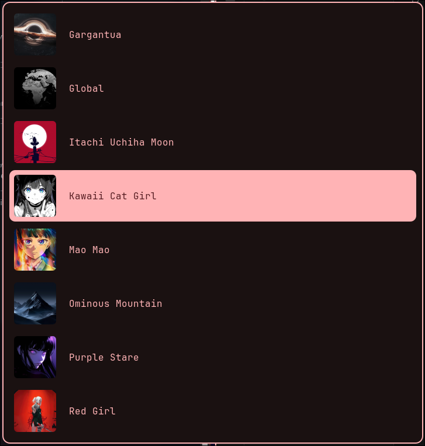
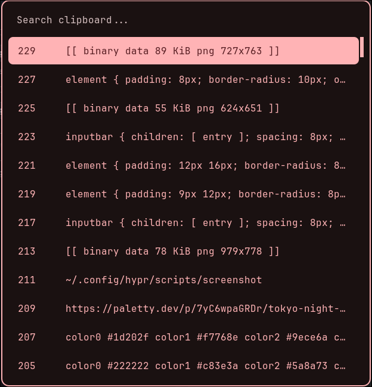
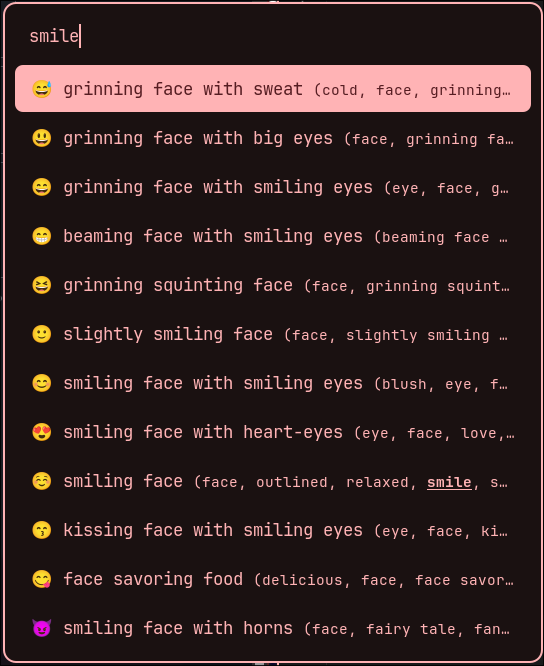
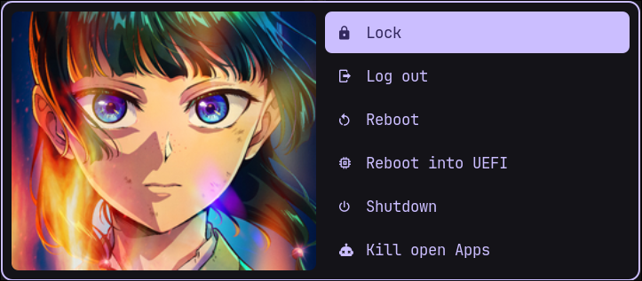
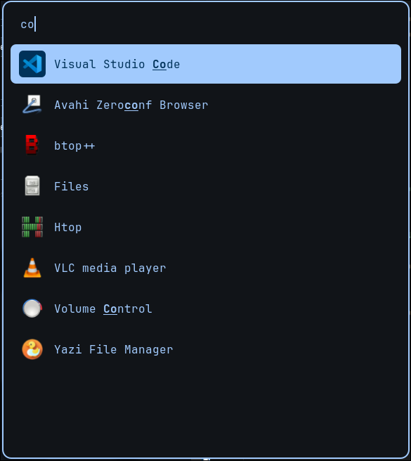

# Box Dots

My hyprland configs with automatic wallpaper theming and rofi menus

### Packages that need to be installed for these configs to work (maybe not complete)
power-profiles-daemon \
rofi \
rofimoji \
waybar \
kitty \
awww \
grimblast \
cliphist \
wtype \
matugen

### Wallpapers and theme generation flow with matugen and rofi

Wallpapers from ~/Pictures/Wallpapers are processed into previews and the right resolution and then shown in a rofi menu with a shortcut (SUPER + P)

- hypr/keybinds.lua 
- hypr/scripts: scripts for preprocessing and caching wallpapers
- ~/.cache/box-dots: cached previews and formatted wallpapers for faster load

### Clipboard with history

Copy and paste with history, accessible through rofi menu (SUPER + V)

- hypr/exec.lua: Initialize cliphist and wcopy
- hypr/keybinds.lua: menu key bind
- hypr/scripts/clipboard-history-menu.sh: run the clipboard history menu
- rofi/clipboard.rasi: layout for the 

### Emoji Selection

Rofi menu and rofimoji, (SUPER + .)

- hypr/scripts/emoji-picker.sh + rofi/emoji.rasi

### Power menu

- hypr/scripts and rofi

### App launcher

