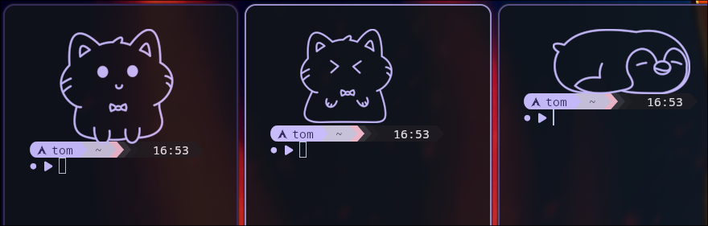

# Box Dots

My Hyprland configs: a Quickshell bar, menus and desktop widgets, all themed from the
current wallpaper with matugen.

### Packages these configs need (maybe not complete)

hyprland \
quickshell \
kitty \
fish \
starship \
zoxide \
matugen \
awww \
python-pyvips \
cliphist \
wl-clipboard \
wtype \
grimblast \
hyprpicker \
hyprlock \
fcitx5 fcitx5-mozc fcitx5-chinese-addons \
rofimoji (only for its emoji data) \
playerctl \
pavucontrol \
ddcutil \
power-profiles-daemon \
iwd iwgtk \
blueman \
tailscale \
dankcalendar (dcal)

```
hyprpm add https://github.com/sandwichfarm/hyprexpo
hyprpm enable hyprexpo
hyprpm reload
```

### Layout

- `hypr/`: Hyprland config in Lua (`hyprland.lua` entry point, `exec.lua` autostart,
  `keybinds.lua`, `look.lua`, `windowrules.lua`, `env.lua`)
- `quickshell/`: everything on screen besides windows, run as `qs` (hot-reloads on save)
  - `Bar.qml` + `modules/`: the powerline bar, some blocks open hover popups (audio, media,
    calendar, connections)
  - `menus/`: launcher, clipboard, emoji, nerd font, keybinds, power and wallpaper menus
  - `WeekCalendar.qml`, `TodoList.qml`, `HabitTracker.qml`: desktop widgets backed by dcal
  - `Notifs.qml`, `NotificationPopups.qml`, `NotificationCenter.qml`: the notification daemon,
    its popups and the notification center (click the bell in the bar; right click toggles do not
    disturb)
- `matugen/`: templates for every generated color file
- `hypr/scripts/`: screenshot script and the Python helpers the menus call

### Wallpapers and theming

Wallpapers in `~/Pictures/Wallpapers` are resized and thumbnailed into `~/.cache/box-dots`
and shown in the wallpaper picker (SUPER + P). Picking one sets it with awww and runs
`matugen`, which regenerates the colors for Hyprland, Quickshell, kitty, fish, starship,
btop, hyprlock, fastfetch and the fcitx5 theme. Quickshell picks up the new
palette by itself.

### Menus

| Key | Menu |
|---|---|
| SUPER + SPACE | Start menu: app launcher, recent files, media, quick toggles, volume and brightness |
| SUPER + V | Clipboard history, with image previews |
| SUPER + . | Emoji picker (copies to the clipboard) |
| SUPER + , | Nerd Font glyph picker |
| SUPER + P | Wallpaper picker |
| SUPER + K | Keybind reference |
| SUPER + ESCAPE | Power menu |

### Other keys

| Key | Action |
|---|---|
| SUPER + D | Show / hide the desktop widgets |
| SUPER + TAB | Workspace overview (hyprexpo) |
| CTRL + SPACE | Cycle input method (English, Japanese, Chinese) |
| SHIFT + SUPER + S | Screenshot of an area |
| SHIFT + SUPER + C | Pick a color to the clipboard |
| SUPER + L | Lock screen |

The bar has workspaces, the window title, CPU/memory, media, audio, network, bluetooth,
tailscale and input method blocks, the tray and an animated gif (any gif dropped into
`~/Pictures/waybar-gifs`; click to switch). The Arch logo opens the power menu.

### Cute pets in the terminal

- random pet when opening kitty, or with the command "c"


